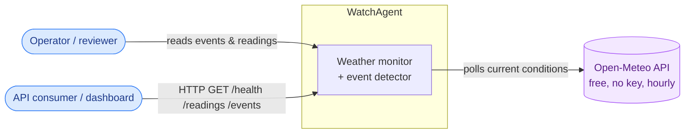
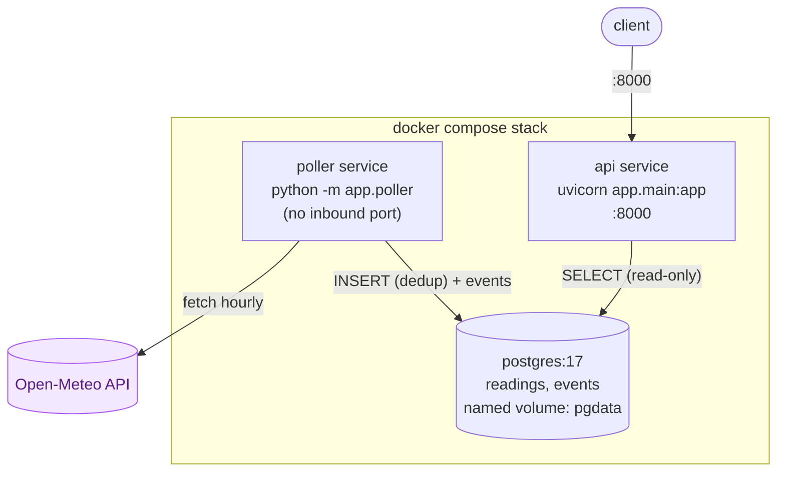
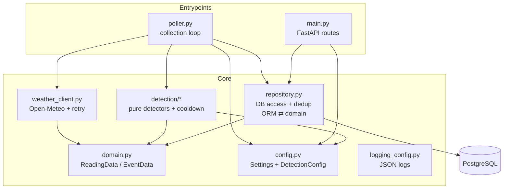
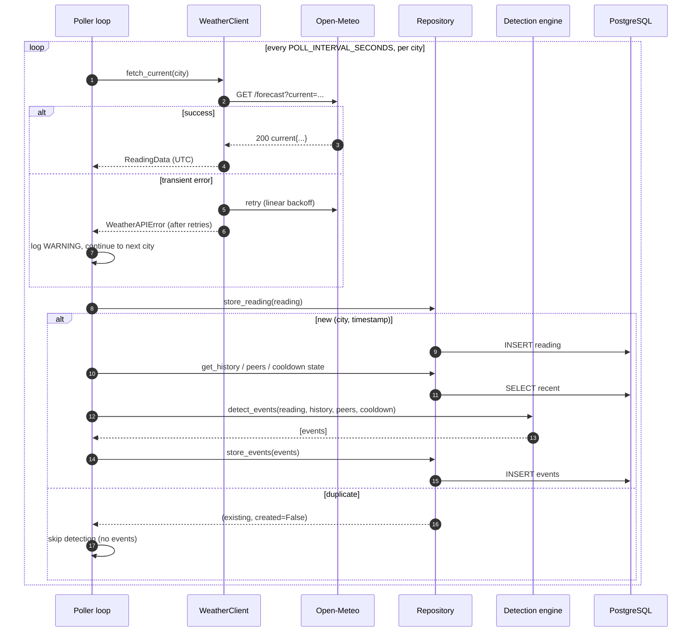
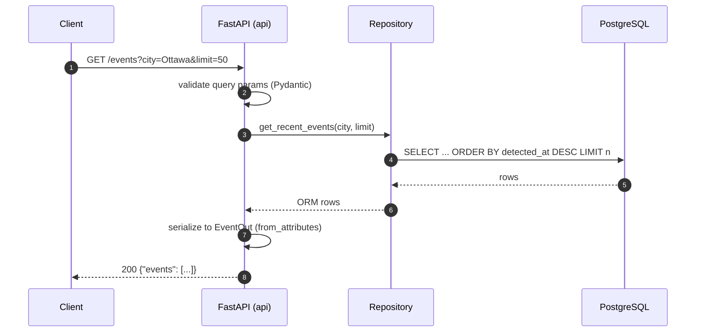
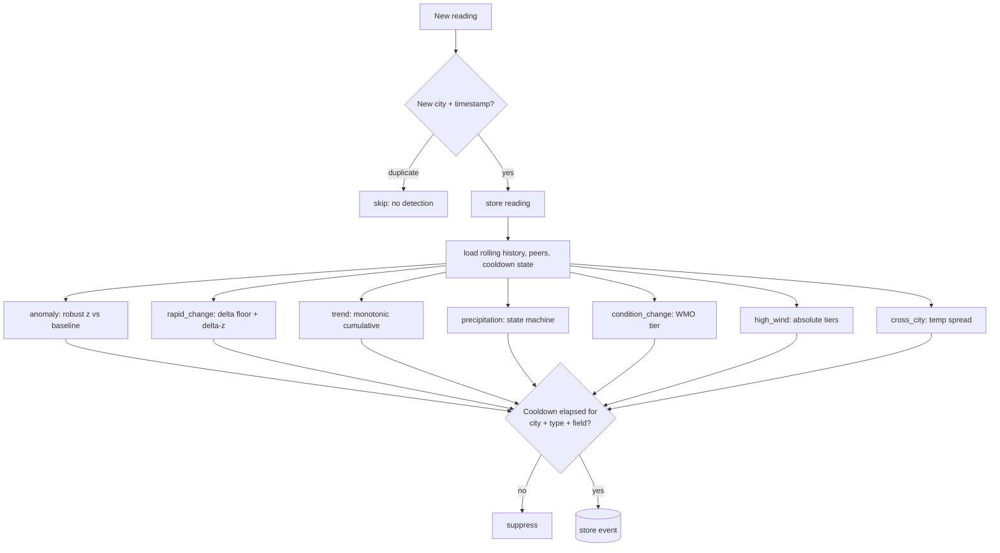
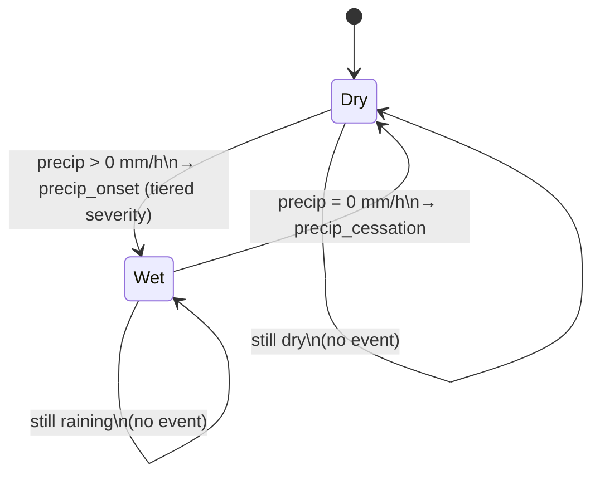
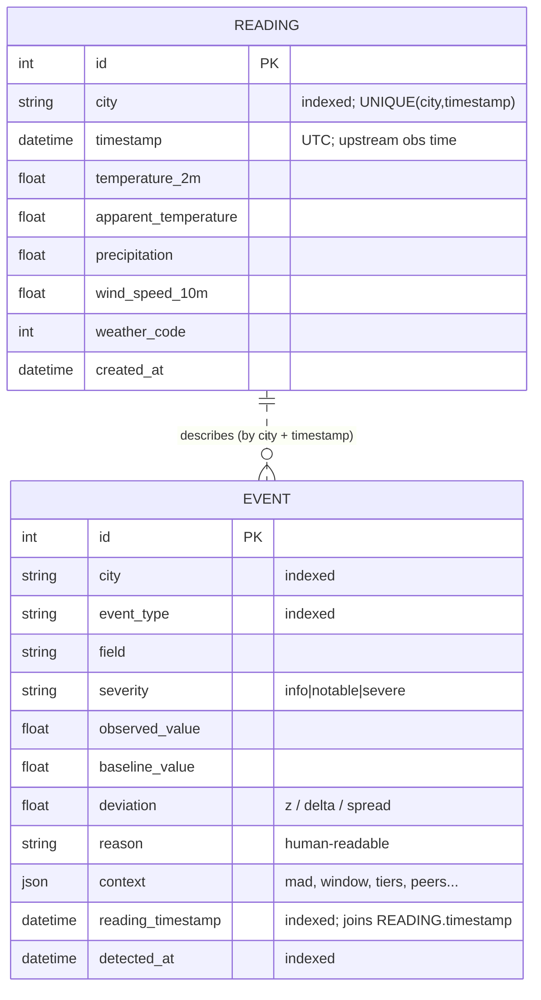
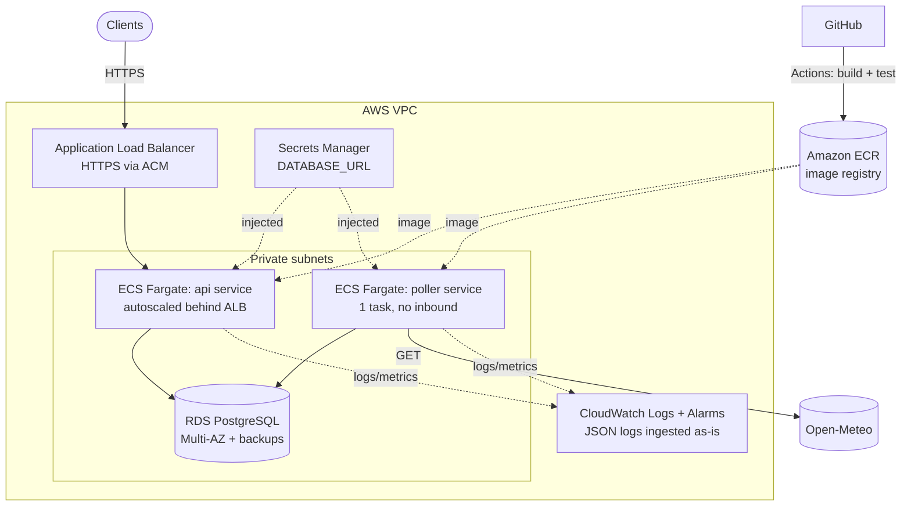
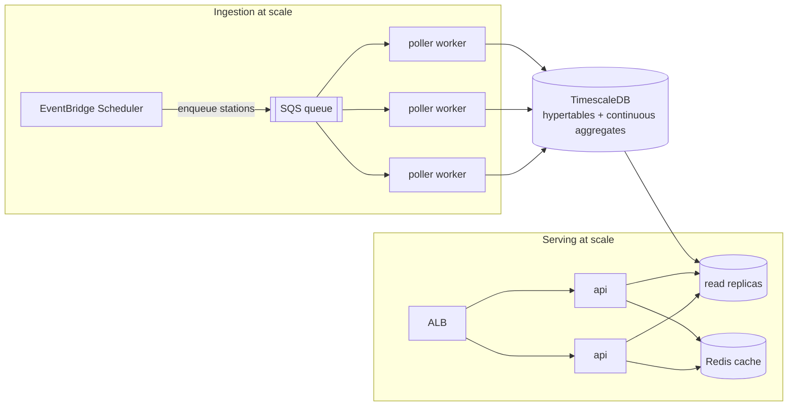

# Architecture & diagrams

End-to-end visual documentation of WatchAgent: how the pieces fit, how a reading
flows from the upstream API to a stored event, the data model, and how this would
run and scale in the cloud.

> **Interactive viewing.** All diagrams below are [Mermaid](https://mermaid.js.org/)
> and render directly on GitHub. To explore one interactively (pan, zoom, edit),
> paste it into <https://mermaid.live>. The **live, clickable API** is the Swagger
> UI the service itself serves at <http://localhost:8000/docs>. Under each diagram
> is a *Jump to source* list linking to the code it describes.

## Contents
- [1. System context](#1-system-context)
- [2. Container view (runtime)](#2-container-view-runtime)
- [3. Component view (inside the image)](#3-component-view-inside-the-image)
- [4. Sequence — a poll cycle (end to end)](#4-sequence--a-poll-cycle-end-to-end)
- [5. Sequence — an API request](#5-sequence--an-api-request)
- [6. Detection decision flow](#6-detection-decision-flow)
- [7. Precipitation state machine](#7-precipitation-state-machine)
- [8. Data model (ER)](#8-data-model-er)
- [9. Cloud deployment (AWS)](#9-cloud-deployment-aws)
- [10. How I would scale it](#10-how-i-would-scale-it)

---

## 1. System context

Who and what the system talks to.

---

## 2. Container view (runtime)

Three processes, one image, one database. The poller writes; the API reads.

*Why separate poller and API containers, and why the DB port is not published —
see [DECISIONS.md](DECISIONS.md) (ADR-6, ADR-8).*

**Jump to source:** [app/poller.py](app/poller.py) · [app/main.py](app/main.py) · [docker-compose.yml](docker-compose.yml)

---

## 3. Component view (inside the image)

The same code powers both services; each entrypoint uses the slices it needs.
Only the repository touches SQLAlchemy; the detection engine is pure.

**Jump to source:** [app/weather_client.py](app/weather_client.py) · [app/repository.py](app/repository.py) · [app/detection/](app/detection/) · [app/domain.py](app/domain.py) · [app/config.py](app/config.py)

---

## 4. Sequence — a poll cycle (end to end)

What happens each interval, for each city. Note the dedup short-circuit and that
the network fetch is outside the DB transaction.

**Jump to source:** [app/poller.py](app/poller.py) · [app/weather_client.py](app/weather_client.py) · [app/detection/detector.py](app/detection/detector.py)

---

## 5. Sequence — an API request

**Jump to source:** [app/main.py](app/main.py) · [app/schemas.py](app/schemas.py)

---

## 6. Detection decision flow

**Jump to source:** [app/detection/rules.py](app/detection/rules.py) · [app/detection/detector.py](app/detection/detector.py) · [app/detection/baselines.py](app/detection/baselines.py)

---

## 7. Precipitation state machine

Precipitation is zero-inflated, so it is modelled as a state machine rather than
scored statistically.

**Jump to source:** [app/detection/rules.py](app/detection/rules.py) (`detect_precip_transition`)

---

## 8. Data model (ER)

There is no hard FK between them (events are derived, and a reading may yield
0..n events); they relate logically on `(city, reading_timestamp)`.

**Jump to source:** [app/models.py](app/models.py)

---

## 9. Cloud deployment (AWS)

The container-per-role design maps cleanly onto managed services. Target: a
small, secure, observable footprint that the same image deploys into unchanged.

**Service choices and why**

| Concern | Service | Why |
|---|---|---|
| Image registry | **Amazon ECR** | Private registry; GitHub Actions pushes the same image CI already builds. |
| Compute | **ECS on Fargate** — `api` + `poller` as two services | Serverless containers, no nodes to manage; the existing two-process split maps 1:1. The API service autoscales; the poller runs a single task. |
| Ingress | **ALB + ACM** | TLS termination, health checks against `/health`, path routing. |
| Database | **RDS for PostgreSQL** (Multi-AZ) | Managed Postgres with backups/failover; the app is already plain Postgres. Aurora Serverless v2 if bursty. |
| Secrets | **Secrets Manager / SSM** | `DATABASE_URL` injected into task definitions; nothing in the image or repo. |
| Logs/metrics | **CloudWatch** (+ optional Managed Grafana/Prometheus) | The service already emits one-line JSON, ingested and queryable as-is; alarms on poll success rate. |
| IaC | **Terraform** (or AWS Copilot) | Reproducible, reviewable infra. |
| CI/CD | **GitHub Actions → ECR → ECS deploy** | Extends the existing pipeline: on green `main`, build, push, update the ECS services. |

**Serverless variant.** Poller as a **Lambda on an EventBridge Scheduler** (hourly,
matching upstream cadence) instead of an always-on task; API as **Lambda + API
Gateway** via an ASGI adapter (Mangum); **Aurora Serverless v2** scaling to near-zero
when idle — cheapest for low, spiky traffic.

**GCP equivalent.** Cloud Run (api) · Cloud Run Job + Cloud Scheduler (poller) ·
Cloud SQL for PostgreSQL · Secret Manager · Cloud Logging/Monitoring · Artifact
Registry.

---

## 10. How I would scale it

Today: 3 cities, hourly data, one poller. The path from here to thousands of
stations and high read traffic:

- **Poller throughput.** Replace the single loop with a **work queue (SQS)**: a
  scheduler enqueues "stations due to poll", and a pool of stateless workers
  drains it. The `UNIQUE(city, timestamp)` dedup makes re-delivery safe, so
  workers need no coordination beyond the queue. Shard by region if needed.
- **Database.** Move readings to **TimescaleDB hypertables** (time partitioning),
  use **continuous aggregates** to precompute rolling baselines instead of
  recomputing per poll, add **read replicas** for the API, and apply
  **retention/downsampling** policies for old raw data.
- **Detection.** For many stations, move per-reading Python detection into a
  **stream processor** (Kafka + Flink/Faust) maintaining incremental per-station
  baselines, or refresh baselines from materialized views — the detectors stay
  pure, only their inputs change.
- **API.** Already stateless → autoscale horizontally; add a **Redis cache** for
  hot queries (`/health` counts, latest readings/events) with write-through
  invalidation.
- **Resilience.** Circuit breaker + rate limiting around the upstream API, a
  **dead-letter queue** for repeatedly failing polls, and per-source backoff
  (the client already retries with backoff).
- **Observability.** Prometheus metrics + OpenTelemetry traces, Grafana
  dashboards, and alerts on *poll success rate* and *abnormal event volume*
  (a monitor that goes silent is itself an incident).
- **Delivery.** Blue/green ECS deploys; multi-region active/passive for HA.
