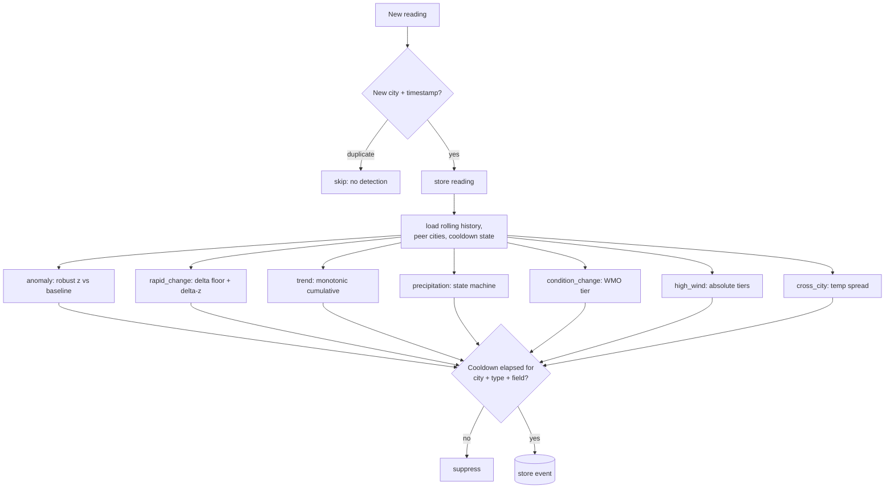

# WatchAgent — Weather Monitor & Notable-Event Detector

[](https://github.com/Moisekenge/watchagent/actions/workflows/ci.yml)


WatchAgent polls live weather for **Ottawa, Toronto, and Vancouver**, decides
when something genuinely notable has happened, and exposes both the raw readings
and the detected events over an HTTP API.

The interesting part of this problem is not collecting data — it is **deciding
what matters**. WatchAgent's detection layer is built around one principle:
*notability is relative to context*. The same 5 °C swing is unremarkable in
continental Ottawa and alarming on Vancouver's stable maritime coast, so the
system calibrates itself to each city's own behaviour rather than firing on
hard-coded thresholds.

---

## Quick links

| Resource | Link |
|---|---|
| **Repository** | <https://github.com/Moisekenge/watchagent> |
| **CI — live status & run history** | [GitHub Actions ▸ CI](https://github.com/Moisekenge/watchagent/actions/workflows/ci.yml) |
| **CI workflow file** | [`.github/workflows/ci.yml`](.github/workflows/ci.yml) |
| **Architecture & all diagrams** | [ARCHITECTURE.md](ARCHITECTURE.md) |
| **Design decisions (ADRs)** | [DECISIONS.md](DECISIONS.md) |
| **Handover / operations guide** | [HANDOVER.md](HANDOVER.md) |
| **Cursor setup (graded)** | [rules](.cursor/rules/) · [agents](.cursor/agents/) · [skills](.cursor/skills/) |
| **API docs (when running)** | <http://localhost:8000/docs> |
| **License** | [MIT](LICENSE) |

---

## Table of contents

- [Quick links](#quick-links)
- [For reviewers — step-by-step](#for-reviewers--step-by-step) ← start here
- [Architecture](#architecture)
- [Proof it runs](#proof-it-runs)
- [Quick start](#quick-start)
- [Running & testing locally](#running--testing-locally)
- [API reference](#api-reference)
- [Event detection design](#event-detection-design) ← the core
- [Detector tuning evidence](#detector-tuning-evidence-reproducible)
- [Technology choices](#technology-choices)
- [Running the tests](#running-the-tests)
- [Cursor setup](#cursor-setup) ← rules, agents, skills
- [Cloud deployment & scaling](#cloud-deployment--scaling)
- [Project layout](#project-layout)

> **Companion docs:** **[ARCHITECTURE.md](ARCHITECTURE.md)** — the full set of
> interactive UML/Mermaid diagrams (context, container, component, sequence, state,
> ER, cloud, scaling). **[DECISIONS.md](DECISIONS.md)** — architecture decision
> records with the alternatives rejected. **[HANDOVER.md](HANDOVER.md)** — the
> operations guide: run paths (terminal & AI agent), runbook, troubleshooting,
> and how to extend each part.

---

## For reviewers — step-by-step

A guided path from a clean clone to "I've watched every deliverable run." Pick
**Option A** (Docker, exactly as the brief specifies) or **Option B** (no Docker
— just tests and skills in a virtualenv). Both take a few minutes.

### Option A — the full stack with Docker (matches the brief)

```bash
# 1. Clone and start everything: API + poller + Postgres
git clone https://github.com/Moisekenge/watchagent.git
cd watchagent
cp .env.example .env                 # local dev defaults — no real secrets
docker compose up --build            # API comes up on http://localhost:8000
```

```bash
# 2. Confirm the service is alive (in a second terminal)
curl http://localhost:8000/health
# → {"status":"ok","readings_stored":<int>,"events_stored":<int>}
# …or open the interactive Swagger docs:  http://localhost:8000/docs
```

```bash
# 3. Look at what the live poller has collected.
#    (Open-Meteo only refreshes hourly, so events are sparse at first —
#     jump to step 4 to see the detection engine light up immediately.)
curl "http://localhost:8000/readings?limit=5"
curl "http://localhost:8000/events?city=Ottawa&limit=5"
```

```bash
# 4. Seed the reproducible 72-hour sample dataset straight into the running
#    database, then re-check the API — now there are events of every type.
docker compose exec api python scripts/generate_demo_data.py --reset
curl "http://localhost:8000/events?limit=10"
```

```bash
# 5. Interrogate the dataset with the graded Cursor skills (run INSIDE the
#    stack so they reach Postgres over Compose's network — no host ports needed)
docker compose exec api python .cursor/skills/data-analysis/scripts/analyze.py overview
docker compose exec api python .cursor/skills/data-analysis/scripts/analyze.py compare
docker compose exec api python .cursor/skills/data-analysis/scripts/analyze.py city Vancouver
docker compose exec api python .cursor/skills/data-analysis/scripts/analyze.py events --severity severe
docker compose exec api python .cursor/skills/replay-detection/scripts/replay.py
docker compose exec api python .cursor/skills/dedup-audit/scripts/audit.py
```

```bash
# 6. (Optional) prove persistence: the DB survives a restart
docker compose restart            # readings_stored is unchanged afterwards
```

### Option B — no Docker (tests + skills in a virtualenv)

```bash
git clone https://github.com/Moisekenge/watchagent.git
cd watchagent
python -m venv .venv
source .venv/bin/activate          # Windows: .venv\Scripts\Activate.ps1
pip install -r requirements-dev.txt

# Run the test suite — mocks every weather call, uses in-memory SQLite
pytest -q                          # 29 tests, no network, no DB service
ruff check app tests

# Seed a local SQLite dataset and drive the skills against it
python scripts/generate_demo_data.py --database-url sqlite:///demo.db --reset
python .cursor/skills/data-analysis/scripts/analyze.py overview --database-url sqlite:///demo.db
python .cursor/skills/replay-detection/scripts/replay.py --database-url sqlite:///demo.db
```

### Option C — drive it with an AI agent (Cursor / Claude Code)

This project ships a complete Cursor environment, so an AI coding agent can run
and explore it for you. Open the repo in **Cursor** (or **Claude Code** /
Copilot agent mode) and give it plain-language instructions — it executes the
same terminal commands above and reads the skill output back to you. Each skill
has a `SKILL.md` describing when and how to invoke it, so the agent can pick the
right one on its own.

Example prompts you can give the agent:

```text
Start the stack with docker compose, wait for /health to return ok, then seed
the demo dataset and tell me how many events of each type fired.

Run the data-analysis skill and compare the three cities over the last 24 hours.
Which city is warmest right now and what's the spread?

Replay the stored readings through the detector with and without the cooldown,
and explain how much noise the cooldown suppresses.

Run the dedup-audit skill and confirm there are no duplicate (city, timestamp)
rows or collection gaps.
```

The two scoped reviewer agents under [`.cursor/agents/`](.cursor/agents/) are for
*reviewing code* (see [Cursor setup ▸ Agents](#agents--cursoragents)); the prompts
above are for the everyday agent simply operating the stack and the skills.

> Operating, maintaining, or extending this beyond a quick look? See the
> **[handover guide](HANDOVER.md)** — run paths (terminal & AI agent),
> operations, troubleshooting, and where to extend each part.

### Where the thinking lives (what to read, in order)

1. **The core reasoning** → [Event detection design](#event-detection-design) and
   the reproducible [tuning evidence](#detector-tuning-evidence-reproducible).
2. **The detectors themselves** → [`app/detection/rules.py`](app/detection/rules.py)
   (seven detectors) and [`app/detection/baselines.py`](app/detection/baselines.py)
   (robust median/MAD statistics).
3. **Why each threshold** → [DECISIONS.md](DECISIONS.md) (ADRs with rejected
   alternatives).
4. **The Cursor environment (graded)** → [Cursor setup](#cursor-setup) — rules,
   the two scoped agents, and the skills.

---

## Architecture

Three independent processes share one database. The **poller** writes; the
**API** reads. They run as separate containers so their lifecycles are decoupled
— the API restarting never interrupts collection, and a poller crash never takes
the API offline.

```
                          Open-Meteo API
                       (current weather, hourly)
                                │
                                │  HTTPS GET  (httpx, timeout + retry/backoff)
                                ▼
   ┌──────────────────────────────────────────────────────────┐
   │  POLLER  (python -m app.poller)                            │
   │                                                            │
   │   for each city, every POLL_INTERVAL_SECONDS:              │
   │     1. fetch current conditions ───────────────┐          │
   │     2. dedupe on (city, timestamp) ── new? ──┐  │          │
   │     3. store reading                         │  │          │
   │     4. detect_events(reading, history, ...)  │  │          │
   │     5. store events                          │  │          │
   └───────────────────────────────┬──────────────┴──┴──────────┘
                                    │ writes
                                    ▼
                  ┌──────────────────────────────────┐
                  │  POSTGRES  (named volume: pgdata) │
                  │   readings · events               │  ← persists across
                  └──────────────────────────────────┘     restarts
                                    ▲
                                    │ reads
   ┌────────────────────────────────┴───────────────────────────┐
   │  API  (uvicorn app.main:app  →  http://localhost:8000)      │
   │   GET /health    GET /readings    GET /events    /docs      │
   └─────────────────────────────────────────────────────────────┘
```

**Why this shape?** The detection engine (`app/detection/`) is deliberately a
set of **pure functions** with no database or clock dependency. The poller is
the only place that touches I/O and orchestration. This separation is what makes
the detection logic exhaustively unit-testable and what lets the Cursor
*replay-detection* skill re-run the exact same logic over historical data.

> For the full set of diagrams — context, container, component, end-to-end
> sequence, precipitation state machine, ER model, and cloud/scaling — see
> **[ARCHITECTURE.md](ARCHITECTURE.md)** (rendered Mermaid, interactive on GitHub).

---

## Quick start

Requirements: **Docker** and **Git**. Nothing else.

```bash
git clone <your-repo-url>
cd watchagent
cp .env.example .env          # local dev defaults; no real secrets
docker compose up --build
```

Then:

- API: <http://localhost:8000> — interactive docs at <http://localhost:8000/docs>
- The poller begins collecting immediately; new readings appear within one poll
  interval (default 300 s). Open-Meteo only refreshes hourly, so a fresh reading
  per city lands roughly once an hour — the more frequent polls exercise the
  deduplication path.
- The database persists in the `pgdata` named volume across
  `docker compose down` / `up` (use `docker compose down -v` to wipe it).

> The database port is **not** published to the host — the API on `:8000` is the
> only exposed port, so the stack starts cleanly even on a machine already
> running Postgres on 5432. (To reach the DB directly from the host, add a
> mapping in `docker-compose.yml`, e.g. `ports: ["5433:5432"]`.)

---

## Running & testing locally

### 1. Start it
```bash
cp .env.example .env
docker compose up --build -d        # or: make up
```
The API comes up at **http://localhost:8000** and the poller starts collecting
immediately. Optionally load a rich sample dataset so events show up right away
(otherwise events accrue as live readings arrive hourly):
```bash
docker compose exec api python scripts/generate_demo_data.py --reset   # or: make seed
```

> **Open the URLs in a real browser (Chrome / Firefox / Edge).** An editor's
> built-in preview pane (e.g. Cursor's) may not render raw JSON — that does *not*
> mean the endpoint is empty.

### 2. Open it (browser)
| What | URL |
|------|-----|
| **Swagger UI** (interactive — click *Try it out*) | <http://localhost:8000/docs> |
| Health | <http://localhost:8000/health> |
| Readings | <http://localhost:8000/readings?limit=10> |
| Events | <http://localhost:8000/events?limit=10> |
| Events for one city | <http://localhost:8000/events?city=Ottawa> |

### 3. Hit it from the terminal
```bash
curl http://localhost:8000/health
curl "http://localhost:8000/readings?city=Vancouver&limit=5"
curl "http://localhost:8000/events?city=Ottawa&limit=5"
```

### 4. Query the collected data (the Cursor skills)
```bash
docker compose exec api python .cursor/skills/data-analysis/scripts/analyze.py overview
docker compose exec api python .cursor/skills/data-analysis/scripts/analyze.py compare --hours 300
docker compose exec api python .cursor/skills/data-analysis/scripts/analyze.py events --severity severe
docker compose exec api python .cursor/skills/replay-detection/scripts/replay.py
docker compose exec api python .cursor/skills/dedup-audit/scripts/audit.py
```

### 5. Run the unit tests
```bash
pip install -r requirements-dev.txt
pytest -q                       # or: make test   → 29 tests
ruff check app tests scripts    # or: make lint
```

### 6. Lifecycle
```bash
docker compose ps               # service status
docker compose logs -f poller   # watch it collect (Ctrl+C to stop following)
docker compose down             # stop, keep the database
docker compose down -v          # stop and wipe the database volume
```

### Where the diagrams live
All ten architecture diagrams are in **[ARCHITECTURE.md](ARCHITECTURE.md)**. They
are [Mermaid](https://mermaid.js.org/) and render **automatically on GitHub**. In
a local editor they show as ```` ```mermaid ```` code blocks unless you install a
Mermaid preview extension — or paste any block into <https://mermaid.live> to view
it interactively.

---

## Proof it runs

Captured from a live `docker compose up --build` (database seeded with the
reproducible sample dataset via `docker compose exec api python
scripts/generate_demo_data.py --reset`):

```text
$ docker compose ps
SERVICE   STATUS                   PORTS
api       Up (healthy)             0.0.0.0:8000->8000/tcp
db        Up (healthy)             5432/tcp          # internal only, not published
poller    Up                       8000/tcp

$ curl -s http://localhost:8000/health
{"status":"ok","readings_stored":216,"events_stored":43}

$ curl -s "http://localhost:8000/events?city=Ottawa&limit=1"
{"events":[{"city":"Ottawa","event_type":"rapid_change","field":"wind_speed_10m",
"severity":"severe","observed_value":16.4,"baseline_value":65.1,"deviation":-48.7,
"reason":"Wind speed fell 48.7 km/h in Ottawa since the previous reading (65.1 → 16.4 km/h).",
"...":"..."}]}
```

Screenshots of the stack and the interactive Swagger UI:

| Docker Desktop — stack running | Swagger UI (`/docs`) | `/events` response |
|---|---|---|
|  |  |  |

> Drop the three PNGs into [`docs/screenshots/`](docs/screenshots/) (see that
> folder's README for exactly what to capture) and they render here.

---

## API reference

All responses are JSON. `city` is an optional exact-match filter; `limit`
defaults to 50, most recent first.

### `GET /health`

```bash
curl http://localhost:8000/health
```
```json
{ "status": "ok", "readings_stored": 42, "events_stored": 7 }
```

### `GET /readings`

```bash
curl "http://localhost:8000/readings?city=Ottawa&limit=5"
```
```json
{
  "readings": [
    {
      "id": 41,
      "city": "Ottawa",
      "timestamp": "2026-05-26T14:00:00+00:00",
      "temperature_2m": 22.4,
      "apparent_temperature": 21.8,
      "precipitation": 0.0,
      "wind_speed_10m": 11.2,
      "weather_code": 1,
      "created_at": "2026-05-26T14:03:11+00:00"
    }
  ]
}
```

### `GET /events`

```bash
curl "http://localhost:8000/events?city=Vancouver&limit=5"
```
```json
{
  "events": [
    {
      "id": 7,
      "city": "Vancouver",
      "event_type": "anomaly",
      "field": "temperature_2m",
      "severity": "severe",
      "observed_value": 28.9,
      "baseline_value": 17.2,
      "deviation": 5.3,
      "reason": "Temperature 28.9°C in Vancouver is 5.3σ above its 31-reading baseline (median 17.2°C).",
      "context": { "mad": 1.48, "window": 31, "method": "modified_zscore" },
      "reading_timestamp": "2026-05-26T21:00:00+00:00",
      "detected_at": "2026-05-26T21:02:55+00:00"
    }
  ]
}
```

Every event answers **what** (`event_type` + `field` + `reason`), **where**
(`city`), **when** (`reading_timestamp`), and **why** (`observed_value` vs
`baseline_value`, the numeric `deviation`, and `context`).

---

## Event detection design

> This is the heart of the project. The full rationale lives here; the code is in
> [`app/detection/`](app/detection/) and the tests that pin the behaviour are in
> [`tests/test_detection.py`](tests/test_detection.py).

### Guiding principles

1. **Notability is relative to context.** A reading is judged against the city's
   own recent history, not a universal constant.
2. **Different fields carry different signal.** Temperature, wind, precipitation,
   and weather-code each get logic suited to how they actually behave.
3. **Selectivity over recall.** A detector that never goes quiet is as useless as
   one that never fires. Noise is controlled explicitly.

### Why robust statistics (median + MAD), not mean + standard deviation

Most detectors compare a value to a per-city baseline using the **modified
z-score** (Iglewicz & Hoaglin):

```
z = 0.6745 · (x − median) / MAD          (MAD = median absolute deviation)
```

The quantity we are trying to detect *is* an outlier — and a single outlier
inflates the mean and standard deviation, letting an extreme value partially mask
itself. The median and MAD are resistant to that contamination. This choice also
delivers the per-city calibration the challenge asks for **for free**: maritime
Vancouver has a small temperature MAD, so the same absolute swing produces a
larger z-score there than in Ottawa. Sensitivity is *learned from each city's
data* instead of guessed. When the MAD is zero (a very flat window) the code
falls back to a mean-absolute-deviation estimate so it never divides by zero.

### The seven event types

Each one reads a different *kind* of signal. They intentionally overlap a little
(a single dramatic jump can be both an `anomaly` and a `rapid_change`) — that
layering is signal, not redundancy, and the cooldown keeps the volume sane.

| # | Event | What it catches | How it decides |
|---|-------|-----------------|----------------|
| 1 | `anomaly` | A reading that is extreme **in context** | Modified z-score of temp / apparent-temp / wind vs the rolling per-city baseline exceeds `ANOMALY_Z` (3.5). |
| 2 | `rapid_change` | A sharp step **vs the previous reading** | Hour-over-hour delta clears an absolute floor **and** is unusual against the city's own distribution of deltas. Both gates must pass, so a volatile city isn't spammed. |
| 3 | `trend` | A gradual front a single delta would miss | A monotonic run over `TREND_WINDOW` readings whose cumulative move exceeds a per-field threshold. |
| 4 | `precip_onset` / `precip_cessation` | Rain/snow starting or stopping | Precipitation is **zero-inflated**, so a z-score is meaningless. A state machine fires on dry→wet and wet→dry, with intensity tiers (light/moderate/heavy) setting severity. |
| 5 | `condition_change` | A categorical shift like clear→thunderstorm | WMO codes are mapped to severity *tiers*; an event fires when crossing into, out of, or escalating within "significant" weather — independent of any numeric magnitude. |
| 6 | `high_wind` | Dangerous absolute wind | Hard human-meaningful tiers (strong ≥ 40 km/h, gale ≥ 62 km/h). Fires only when a tier is **newly crossed upward**, so sustained wind doesn't re-fire. Complements `anomaly`, which covers "unusual *for this city*". |
| 7 | `cross_city_divergence` | Regional spread across the cities | When the max−min temperature across monitored cities exceeds `CROSS_CITY_SPREAD_C` (18 °C), attributed to the extreme (warmest/coldest) city so one divergent moment yields one event, not three. |

### Detection flow



### Controlling noise (sensitivity vs. noise)

- **Cooldown / refractory period.** After an event fires for a
  `(city, event_type, field)` stream, the same stream is suppressed for
  `COOLDOWN_HOURS` (3 h; 6 h for slow-moving trends). A multi-hour anomaly is
  announced once, not every poll.
- **Cold-start guard.** Statistical detectors stay silent until a city has
  `MIN_HISTORY` (8) readings, so we never call something anomalous before we know
  what normal looks like. `rapid_change` still works earlier via its absolute
  floor.
- **Severity tiers** (`info` / `notable` / `severe`) make the stream filterable
  (`GET /events?severity=…` via the analysis skill) and testable.

The shipped posture is **balanced**: every threshold is an environment variable,
but the defaults are tuned to fire on genuinely notable weather and stay quiet
otherwise. You can quantify the noise trade-off empirically with the
*replay-detection* skill (run it with and without `--no-cooldown`).

### What's stored

Each event row carries `city`, `event_type`, `field`, `severity`,
`observed_value`, `baseline_value`, `deviation`, a human-readable `reason`, a
machine-readable `context` blob, the `reading_timestamp` it describes, and the
`detected_at` time.

> For the deeper rationale behind each choice — robust stats, the field-specific
> detectors, the cooldown, sync vs async, and the alternatives rejected — see
> **[DECISIONS.md](DECISIONS.md)**.

---

## Detector tuning evidence (reproducible)

The design above is not theoretical. A deterministic 72-hour sample dataset
(`scripts/generate_demo_data.py`) replayed through the detector produces these
**measured** numbers — reproduce them in under a minute:

```bash
python scripts/generate_demo_data.py --database-url sqlite:///demo.db --reset
python .cursor/skills/replay-detection/scripts/replay.py --database-url sqlite:///demo.db
python .cursor/skills/replay-detection/scripts/replay.py --database-url sqlite:///demo.db --no-cooldown
# per-city calibration figures below:
python .cursor/skills/data-analysis/scripts/analyze.py city Vancouver --hours 72 --database-url sqlite:///demo.db
python .cursor/skills/data-analysis/scripts/analyze.py city Ottawa --hours 72 --database-url sqlite:///demo.db
```

The generated series is anchored to end at the current hour (with reproducible
values keyed to the hour offset), so the time-windowed analysis commands above
work against it with their default windows.

**Cooldown earns its keep.** Over 216 readings (3 cities × 72 h):

| Configuration | Events fired |
|---|---|
| Cooldown **disabled** (`--no-cooldown`) | **78** |
| Default cooldown (3 h / 6 h trends) | **44** |

That is **≈44 % suppression** — the cooldown collapses repeated firings during
sustained episodes (e.g. a multi-hour heat wave) down to one announcement, while
preserving every distinct event. With cooldown on, the 44 break down as
rapid_change 12, trend 10, anomaly 9, condition_change 4, precip_onset 3,
precip_cessation 3, cross_city_divergence 2, high_wind 1 — a healthy spread, not
one detector dominating.

**Per-city calibration is real, not a slogan.** Over the same 72-hour window
(`city <Name> --hours 72`) the data-analysis skill reports a temperature MAD of
**1.85 °C for Vancouver** versus **5.3 °C for Ottawa**. Because the modified z-score divides by MAD, an identical
absolute swing scores ≈**2.9× higher in Vancouver**. Concretely, the detector
flagged a +2.3 °C deviation in Vancouver at 3.9σ; the same 2.3 °C in Ottawa is
only ≈1.1σ — comfortably below the 3.5 threshold. The same change is notable in
one city and unremarkable in the other, with **no per-city threshold
hard-coded**.

---

## Technology choices

| Choice | Why |
|--------|-----|
| **FastAPI** | The endpoints need typed query-param validation, typed JSON responses, and good docs. FastAPI gives Pydantic validation and auto-generated OpenAPI/Swagger (`/docs`) with almost no boilerplate. The workload is light, so its async server is more than enough. |
| **PostgreSQL** | A real relational store with a `UNIQUE(city, timestamp)` constraint enforcing deduplication at the database level, plus a healthcheck and named-volume persistence in Compose — the right primitives for an infrastructure service. |
| **SQLAlchemy 2.0 (sync)** | Clear, typed models. Sync over async on purpose: the data volume is tiny (3 cities, hourly), so async I/O buys no throughput, while sync code has simpler, more obvious failure semantics. Sessions are injected, so the same code runs on Postgres and on SQLite in tests. |
| **httpx** | Modern HTTP client with first-class timeouts and a pluggable transport, which the tests use (`MockTransport`) to exercise the client with zero network. |
| **Separate poller & API containers** | Decoupled lifecycles and a clean read/write split. Same image, two commands. |
| **Structured JSON logging (stdlib)** | One JSON line per event on stdout — friendly to `docker logs` and any shipper — with no extra dependency. |
| **Robust statistics (median/MAD)** | Resistant to the very outliers we detect; see the detection section. |

---

## Running the tests

```bash
pip install -r requirements-dev.txt
pytest -q          # 29 tests
ruff check app tests
```

Tests use **in-memory SQLite** and **mock every weather API call**, so they need
no database service and no network — exactly how they run in CI. Coverage:

- `tests/test_dedup.py` — the weather API is mocked to return the same reading
  twice; asserts exactly **one** row is stored.
- `tests/test_detection.py` — constructs controlled reading sequences and asserts
  each detector **fires** when it should and **stays silent** on near-misses,
  including the cooldown re-arm behaviour. (The over-firing guard is the point.)
- `tests/test_api.py` — asserts the exact `/health`, `/readings`, `/events`
  response shapes, ordering, and filters against a seeded dataset.
- `tests/test_weather_client.py` — UTC normalization, success path, and
  retry-then-raise, all over `httpx.MockTransport`.

---

## Cursor setup

Everything lives in [`.cursor/`](.cursor/) and is specific to *this* codebase.

### Rules — [`.cursor/rules/`](.cursor/rules/)

Active instructions Cursor applies while generating code, each tied to a real
decision here:

| Rule | Encodes |
|------|---------|
| `poller-resilience.mdc` | The exact failure contract: retry with linear backoff, log `city` + `http_status` + `attempt` at WARNING, raise `WeatherAPIError` after exhaustion; `run_cycle` contains per-city failures so one bad city never stops the loop; fetch happens **outside** the DB transaction; honour SIGTERM. |
| `event-record-contract.mdc` | What every `EventData` must carry (what/where/when/why), that detectors are **pure** `(reading, history, config)` functions with injected time, that statistical detectors honour `min_history` and use the robust z-score, and the checklist for adding a new event type (enum + cooldown + fire/no-fire test). |
| `structured-logging.mdc` | No `print()`; static log messages with dynamic values in `extra={}`; required context keys per situation; level discipline. |
| `storage-and-dedup.mdc` | Dedup enforced by both the UNIQUE constraint and the pre-insert check; `(row, created)` contract; injected sessions, never a global; DB-agnostic types so SQLite works in tests; UTC timestamps. |
| `testing-conventions.mdc` | Never hit the network; detection tests assert both directions; SQLite for storage/API tests. |

### Agents — [`.cursor/agents/`](.cursor/agents/)

Two **scoped, read-only reviewer agents**, each pinned to one slice of the
codebase. They are deliberately *narrow*: each knows its own area deeply and
refuses to comment outside it, so their feedback never overlaps or contradicts.

**How a Cursor agent is built** — each is a Markdown file with YAML frontmatter
(`name`, `description`, `model`, `readonly`) followed by a **system prompt**: the
standing instructions the agent runs under *every* time it is invoked. Both
agents use `model: inherit` (they run on whatever model the session uses) and
`readonly: true` (they review and advise — they never edit files). The
`description` is what Cursor reads to decide *when* to suggest the agent.

**At a glance — how the two differ:**

| | `event-detection-reviewer` | `data-layer-reviewer` |
|---|---|---|
| **Owns** | `app/detection/**`, `tests/test_detection.py` | `app/repository.py`, `app/models.py`, `app/db.py` |
| **Question it answers** | "Is this event worth firing, and is the detector pure?" | "Is this query correct, and is it portable?" |
| **Reviews for** | purity · cold-start · noise budget · justification · fire/no-fire tests · defensibility | dedup guarantee · SQLite↔Postgres portability · ordering/filtering · session hygiene · index sanity |
| **Explicitly won't touch** | poller, API, Docker/CI, DB schema | detection logic, HTTP routing |
| **Config** | `model: inherit`, `readonly: true` | `model: inherit`, `readonly: true` |

#### 1. `event-detection-reviewer` — "is this event worth firing, and is it pure?"

- **How it's built** → [`.cursor/agents/event-detection-reviewer.md`](.cursor/agents/event-detection-reviewer.md).
  Its `description` tells Cursor to reach for it *"before merging any change under
  `app/detection/`."* `readonly: true` keeps it advisory.
- **The system prompt it runs under (what it's told):** it is *the event-detection
  reviewer* whose sole job is logic under `app/detection/` and its tests. The
  prompt pre-loads it with this project's real context — the **seven detectors
  layered by signal type** (level, step, trajectory, state machine, categorical,
  absolute tiers, relational), **why the robust modified z-score (median + MAD)**
  is used instead of mean/std, the fact that **Vancouver's small MAD makes it
  intentionally more sensitive than Ottawa**, the per-`(city, event_type, field)`
  **cooldown**, and the `info`/`notable`/`severe` scale. It then runs a six-point
  checklist: **purity** (no I/O, no wall-clock), **cold-start** handling, **noise
  budget** (would this fire on ordinary hourly variation?), **justification
  completeness**, **fire-AND-no-fire** test coverage, and one-sentence
  **defensibility**.
- **Purpose / boundary:** keep new or changed detection logic pure, selective,
  and defensible. It will *not* comment on the poller, API, Docker/CI, or schema.
- **Example prompts a reviewer can try:**
  - *"Review my new `detect_freeze_risk` detector in rules.py for purity and noise budget."*
  - *"Would lowering `anomaly_z` to 3.0 cause over-firing on Vancouver's calm baseline?"*
  - *"Does my new detector have both a fires-on and a stays-silent test? Flag if not."*

#### 2. `data-layer-reviewer` — "is this query correct and portable?"

- **How it's built** → [`.cursor/agents/data-layer-reviewer.md`](.cursor/agents/data-layer-reviewer.md).
  Its `description` scopes it to edits in `app/repository.py`, `app/models.py`,
  and `app/db.py` — the only modules allowed to import SQLAlchemy.
- **The system prompt it runs under (what it's told):** it is *the data-layer
  reviewer*. Context it carries: the same ORM models run on **Postgres in
  production and SQLite in tests** (so generic column types only — no
  Postgres-specific SQL, or CI's database-less test job breaks), the
  **two-mechanism dedup guarantee** (`UNIQUE(city, timestamp)` *plus* the
  pre-insert lookup returning `(row, created)`), **injected sessions** (never a
  module global), and **UTC** storage. Its checklist: dedup intactness, cross-DB
  portability, correct **ordering/filtering** (most-recent-first on the right
  column; filter applied *before* the limit), session hygiene, index sanity, and
  the ORM⇄domain conversion boundary.
- **Purpose / boundary:** catch data-access bugs — especially anything that works
  on Postgres but silently breaks CI's SQLite tests, or that weakens dedup. It
  does *not* review detection logic or routing.
- **Example prompts a reviewer can try:**
  - *"Does this new `get_events_by_field` query run on both SQLite and Postgres?"*
  - *"Did my change to `store_reading` keep the `(row, created)` dedup contract?"*
  - *"Is the most-recent-first ordering in `/events` using an indexed column?"*

### Skills — [`.cursor/skills/`](.cursor/skills/)

Executable scripts the Cursor agent can invoke as tools. Each is a `SKILL.md`
plus a script under `scripts/`. They resolve the database from `--database-url`,
then `$DATABASE_URL`, then a `127.0.0.1:5432` default. Run them **inside the
stack** (always works, no host-port concerns) or from the host. If you already
run PostgreSQL locally on 5432, prefer the in-container form so the container's
published port isn't shadowed.

| Skill | What it does |
|-------|--------------|
| **`data-analysis`** *(the graded one)* | Queries the live database and returns a structured JSON answer. Commands: `overview` (counts, latest timestamps, event breakdowns), `city <Name>` (per-city robust stats + recent events), `compare` (cross-city temperature comparison + current spread), `events` (filtered event list with reasons), `trend <field> <City>` (direction and slope over a window). Reuses the app's own models and robust-stats helpers so its analysis matches how the service reasons. |
| `replay-detection` | Replays stored readings back through `detect_events`, rebuilding history exactly as the poller would, to show what *would* fire under the current (or an overridden) config. Run with/without `--no-cooldown` to quantify how much noise the cooldown layer suppresses — the tuning tool for the sensitivity-vs-noise trade-off. |
| `dedup-audit` | Independently verifies the `(city, timestamp)` dedup guarantee from the data side and flags collection gaps (consecutive readings spaced beyond `--gap-minutes`). |

Example:

```bash
# Inside the running stack (recommended — no host-port concerns):
docker compose exec api python .cursor/skills/data-analysis/scripts/analyze.py overview
docker compose exec api python .cursor/skills/data-analysis/scripts/analyze.py compare --hours 24
docker compose exec api python .cursor/skills/data-analysis/scripts/analyze.py events --severity severe

# Or from the host (deps installed locally):
python .cursor/skills/data-analysis/scripts/analyze.py overview
```

---

## Cloud deployment & scaling

The container-per-role design maps directly onto managed services. Full diagrams
(AWS deployment + scaling topology) are in
**[ARCHITECTURE.md §9–10](ARCHITECTURE.md#9-cloud-deployment-aws)**; the summary:

**Deploy (AWS).** Same image, unchanged. GitHub Actions builds and pushes to
**ECR**; the `api` and `poller` run as two **ECS Fargate** services; an **ALB +
ACM** terminates TLS and health-checks `/health`; data lives in **RDS for
PostgreSQL** (Multi-AZ); `DATABASE_URL` comes from **Secrets Manager**; the JSON
logs flow into **CloudWatch** with alarms on poll success rate; infra is
**Terraform**. A serverless variant runs the poller on an **EventBridge
Scheduler + Lambda** and the API on **Lambda + API Gateway** over **Aurora
Serverless v2**. (GCP equivalent: Cloud Run + Cloud Run Job/Scheduler + Cloud SQL.)

**Scale (from 3 cities to thousands of stations).**
- **Ingestion:** swap the single loop for a **work queue (SQS)** drained by a
  pool of stateless poller workers — the `UNIQUE(city, timestamp)` dedup makes
  redelivery safe, so workers need no coordination.
- **Storage:** **TimescaleDB** hypertables + continuous aggregates to precompute
  rolling baselines, **read replicas** for the API, retention/downsampling.
- **Detection:** move per-reading Python into a **stream processor** (Kafka +
  Flink) keeping incremental per-station baselines; the detectors stay pure.
- **Serving:** the API is stateless → autoscale behind the ALB, with a **Redis**
  cache for hot queries.
- **Resilience/observability:** circuit breaker + DLQ around the upstream;
  Prometheus/Grafana + OpenTelemetry; alert when the monitor goes *silent*.

---

## Project layout

```
watchagent/
├── app/
│   ├── config.py          # env Settings + DetectionConfig (thresholds)
│   ├── domain.py          # ReadingData / EventData dataclasses, enums
│   ├── models.py          # SQLAlchemy ORM (readings, events) + UNIQUE dedup
│   ├── db.py              # engine, sessions, init_db (SQLite/Postgres)
│   ├── repository.py      # all DB access; ORM⇄domain conversions
│   ├── weather_client.py  # Open-Meteo client (UTC, timeout, retry)
│   ├── poller.py          # the collection loop (separate process)
│   ├── main.py            # FastAPI app: /health /readings /events
│   ├── logging_config.py  # JSON logging
│   └── detection/
│       ├── baselines.py   # median, MAD, modified z-score
│       ├── wmo.py         # WMO code → description + severity tier
│       ├── rules.py       # the seven detectors
│       └── detector.py    # orchestrator + cooldown
├── tests/                 # dedup, detection, API, weather-client
├── scripts/               # generate_demo_data.py (reproducible sample dataset)
├── docs/screenshots/      # proof images referenced by the README
├── .cursor/               # rules, agents, skills (graded)
├── .github/workflows/ci.yml
├── Dockerfile
├── docker-compose.yml
├── ARCHITECTURE.md        # full diagram set (context → sequence → ER → cloud → scaling)
├── DECISIONS.md           # architecture decision records
├── HANDOVER.md            # operations guide: run, runbook, troubleshooting, extending
└── .env.example
```

---

## CI

[GitHub Actions](.github/workflows/ci.yml) runs on every push/PR to `main`:

1. **Lint & unit tests** — `ruff check` + `pytest` (SQLite + mocked API, no
   secrets).
2. **Docker build** — `docker build`, proving the image builds with no API keys.

---

## What I'd do with more time

Scoped deliberately to the brief; the natural next steps, roughly in priority:

- **Learned baselines from longer history.** Persist 30+ days per city and seed
  the baseline from it, so detection is well-calibrated immediately after a cold
  start instead of after `MIN_HISTORY` readings.
- **Alerting + metrics.** A webhook/Slack sink for `severe` events, and a
  `/metrics` Prometheus endpoint (events by type/severity, poll success rate,
  fetch latency) so the monitor is itself monitorable.
- **An `/events/{id}` drill-down** returning the event with the surrounding
  window of readings — turning each `reason` into a fully inspectable story.
- **Backfill + TimescaleDB.** Use Open-Meteo's historical API to backfill, and
  partition readings by time (hypertables) if the city set grows large.
- **Detector evaluation harness.** Label a fixture of "should/shouldn't fire"
  episodes and track precision/recall as thresholds change, turning tuning into a
  measured feedback loop on top of the existing replay skill.

---

## Note on AI tool usage

Per the brief, this project was built with AI assistance (Cursor Pro is the
brief's required tool). The **design decisions are my own** and are documented so
they can be defended: the event taxonomy, the choice of robust statistics and
per-city calibration, the noise-control strategy, and the architecture
trade-offs are laid out in [DECISIONS.md](DECISIONS.md) and the sections above.
The AI accelerated implementation and helped enforce the conventions encoded in
[`.cursor/rules/`](.cursor/rules/) — which is exactly the workflow the challenge
sets out to evaluate.
